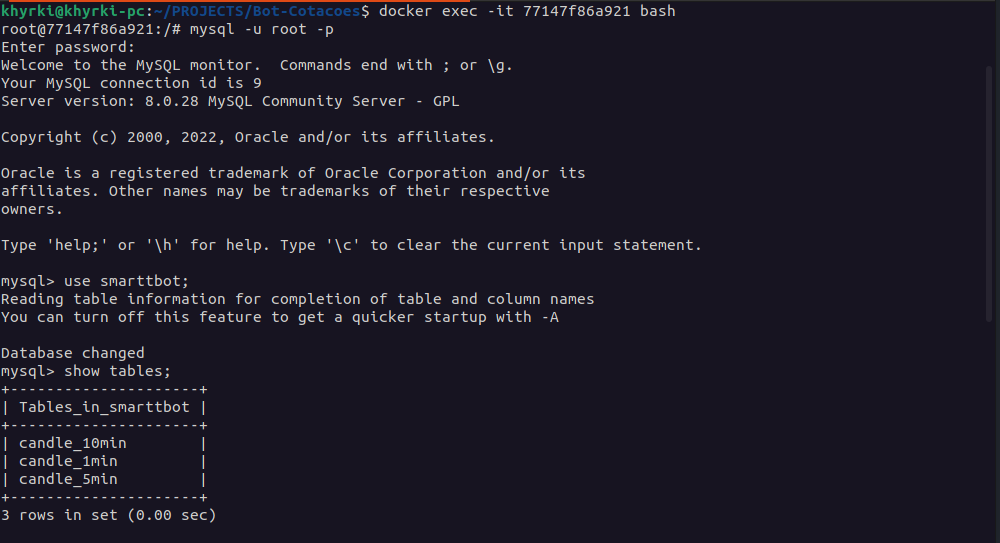

# Boas vindas ao repositório do projeto Bot-Cotações!

Aqui você vai encontrar os detalhes de como iniciar e entender o funcionamento da a aplicação que recebe dados de cotação de crypto moedas da [API Poloniex](https://docs.poloniex.com/#introduction), monta um objeto que representa um candle com dados de abertura, máxima, mínima e fechamento e os salva em um banco de dados MySQL, usando python como linguagem de programação, para garantir o funcionamento correto é necessário ter [Docker](https://www.docker.com/get-started) e [Docker compose](https://docs.docker.com/compose/install/) instalado na sua maquina.

Para iniciar a aplicação execute o comando:

`sudo docker-compose up -d`.

Com a aplicação rodando, a cada 1 minuto, 5 minutos e 10 minutos um novo candle será adicionado ao banco.
Você pode conferir os dados sendo escritos no banco acessando o container que está rodando o MySQL seguindo os seguintes passos:

Escreva o comando `sudo docker ps` e identifique o container que está rodando o banco e copie o ID desse container.

Com o ID execute o comando `docker exec -it (ID DO DOCNTAINER MySQL) bash` para ter acesso ao bash do container e por fim aos dados do banco:

Agora digite o comando `mysql -u root -p` no terminal, irá pedir uma senha, escreva "smarttbot" no campo e aperte enter, se tudo ocorrer bem vocẽ terá acesso ao banco e já pode fazer as consultas as tabelas que possuem as informações de cotação para cada intervalo de tempo:

finalizado a consulta basta sair do mysql com o comando `exit` e do terminal do container também com o comando `exit` e parar a aplicação com o comando `sudo docker-compose down`
