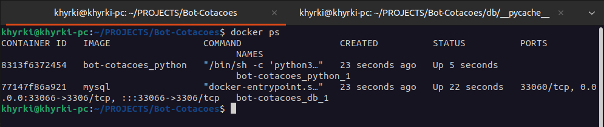

# Boas vindas ao repositório do projeto Bot-Cotações!

Aqui você vai encontrar os detalhes de como iniciar e entender o funcionamento da a aplicação que recebe dados de cotação de crypto moedas da [API Poloniex](https://docs.poloniex.com/#introduction), monta um objeto que representa um candle com dados de abertura, máxima, mínima e fechamento e os salva em um banco de dados MySQL, usando python como linguagem de programação, para garantir o funcionamento correto é necessário ter [Docker](https://www.docker.com/get-started) e [Docker compose](https://docs.docker.com/compose/install/) instalado na sua maquina.
 

Para iniciar a aplicação execute o comando:

`sudo docker-compose up -d`.

Com a aplicação rodando, a cada 1 minuto, 5 minutos e 10 minutos um novo candle será adicionado ao banco.
Você pode conferir os dados sendo escritos no banco acessando o container que está rodando o MySQL seguindo os seguintes passos:

Escreva o comando `sudo docker ps` e identifique o container que está rodando o banco e copie o ID desse container.

Com o ID execute o comando `docker exec -it (ID DO DOCNTAINER MySQL) bash` para ter acesso ao bash do container e por fim aos dados do banco:

Agora digite o comando `mysql -u root -p` no terminal, irá pedir uma senha, escreva "smarttbot" no campo e aperte enter, se tudo ocorrer bem vocẽ terá acesso ao banco e já pode fazer as consultas as tabelas que possuem as informações de cotação para cada intervalo de tempo:

finalizado a consulta basta sair do mysql com o comando `exit` e do terminal do container também com o comando `exit` e parar a aplicação com o comando `sudo docker-compose down`.

## Detalhes do desenvolvimento:

O prazo para esse projeto foi de 6 dias, dediquei os primeiro 4 dias ao aprendizado e para relembrar tecnologias que não sabia ou não usava a algum tempo.
Inicialmente eu optei por fazer a lógica da aplicação usando apenas uma classe, porém estava enfrentando um problema quanto ao tempo de execução, que neste projeto é algo bem importante, precisava que o programa salvasse os candles em um tempo exato, mas da forma que estava o tempo de execução estava sendo somado ao tempo de requisição à api e atrasando 10 a 30 segundos para cada candle. Então resolvi fazer de forma mais desacoplada criando duas classes, uma para marcar o tempo e outra para salvar informações da api, sendo assim, a cada determinado intervalo de tempo definido pela minha classe Timer a minha classe Candle enviaria os dados para o banco com as informações dos candles, assim diminuindo o atraso para cerca de 1 segundo, mas veio um novo problema que era a execução simultânea das duas classes, uma vez que o timer e as cotações não param, fazendo algumas pesquisas encontrei uma solução usando threads para instanciar cada classe de forma independente. Da forma que está o programa realiza consultas para apenas uma moeda, porém da forma que foi pensado acredito que seja simples escalar o funcionamento.

